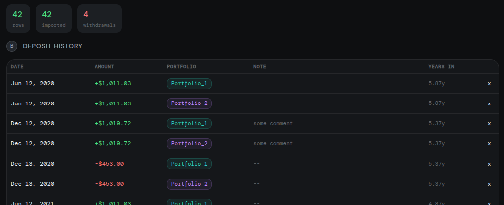
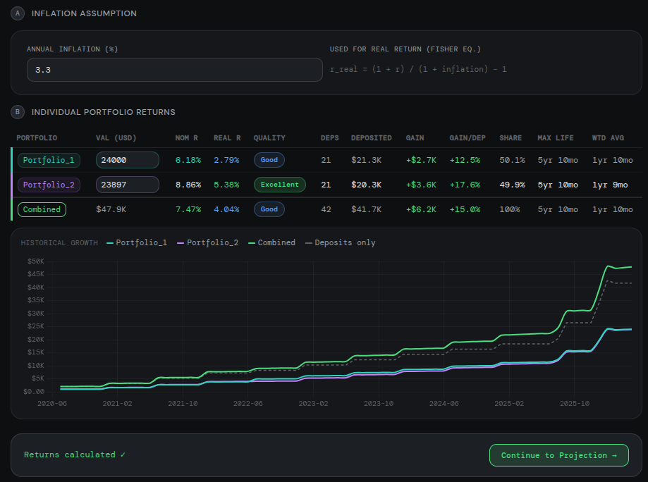
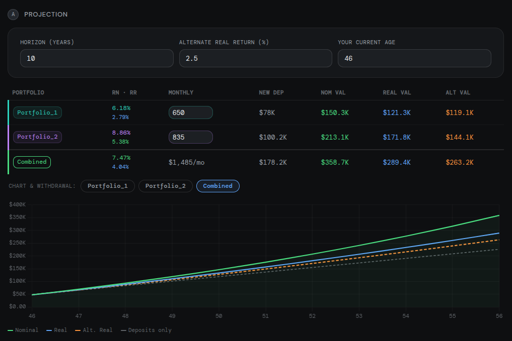
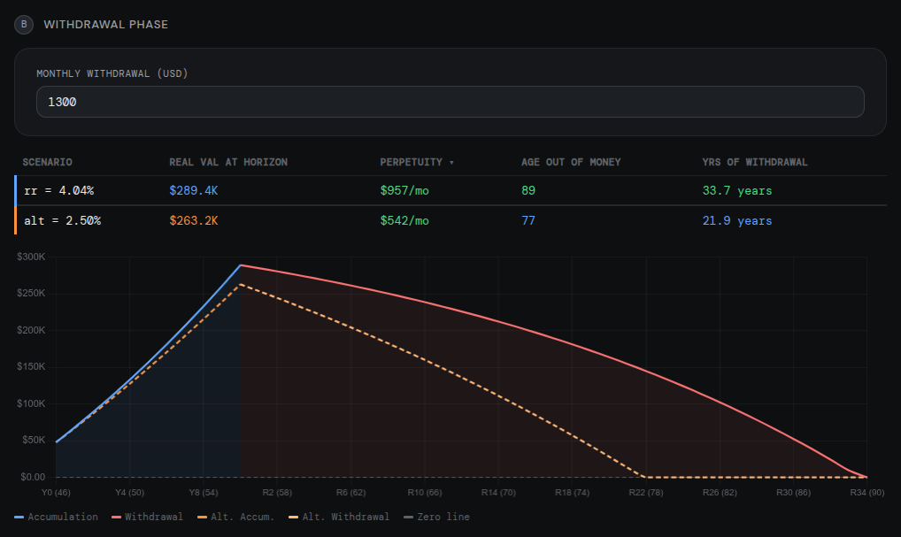

# Portfolio Tracker

A single-file, zero-dependency web app for tracking personal investment portfolios, computing money-weighted returns, and projecting retirement sustainability.

No server. No login. No data ever leaves your browser.

> **Disclaimer:** This tool is provided for informational and educational purposes only. It is not financial advice. Past returns do not guarantee future results. The projections produced by this tool are mathematical illustrations based on inputs you provide — they are not predictions. Do not make investment decisions based solely on this tool. The author bears no responsibility for financial outcomes resulting from use of this software.

BSD 3-Clause — see [LICENSE](LICENSE)

---

## Why this tool exists

An individual investor whose portfolio grows through irregular, real-world deposits needs an easy way to see the evolution of their investments.

This tool computes the **Money-Weighted Rate of Return (MWRR)**, which answers the question that actually matters:

> *Given exactly when and how much I invested, what annualized return does my portfolio imply?*

It then strips out inflation to give you a real return, and runs a simulation to tell you whether your projected retirement portfolio is sustainable at your target withdrawal rate.

---

## Workflow

The app is a 3-step wizard. Each step unlocks the next.

### Step 1 — Data

Upload an Excel file containing your deposit history. The mapper UI lets you match your file's column names to the required fields (date, amount, currency, portfolio name). ARS deposits are converted to USD using the exchange rate column if provided.

Deposits are stored in `sessionStorage` — they exist only for the duration of the browser tab and are wiped automatically when the tab is closed. Data never leaves your machine.

||
|:--:|
|Figure1: Loading of deposits and withdrawals|

### Step 2 — Returns

Each portfolio is shown as a card. Enter the current market value (VAL) directly in the card. Returns calculate automatically. Change the VAL or the inflation assumption and the rates update instantly.

**Inflation assumption:** enter the annual inflation rate (%) to use for computing the real return.

| Assumption | When to use |
|---|---|
| 3% | Standard long-run USD assumption |
| 4–4.5% | Conservative; appropriate if you expect persistently above-target inflation |
| > 4.5% | Stress-test scenario |

A higher inflation assumption lowers the computed real return. When in doubt, run the tool twice (once at 3%, once at 4.5%) to bracket the outcome.

Each card shows: nominal r, real r, quality badge, deposit count, current VAL, total deposited, gain, max lifetime (age of oldest deposit), and weighted average time (dollar-weighted average age of deposits).

The combined card auto-populates once all portfolio VALs are entered and shows aggregated metrics across all portfolios.

||
|:--:|
|Figure2: Nominal and Real rates|

### Step 3 — Projection & Withdrawal

Configure planned monthly deposits per portfolio and a time horizon. The app projects:

- **Nominal VAL** — future value at the nominal MWRR
- **Real VAL** — future value in today's purchasing power
- **Alternate Real VAL** — same projection at a user-specified alternate real return, for scenario comparison

A growth chart overlays all three curves over the chosen horizon.

Below the chart, a sustainability simulation asks: *after the horizon ends, how much do you withdraw monthly?* It computes whether the portfolio survives indefinitely or depletes, and if so, at what age. Both the main scenario and the alternate scenario are shown together.

||
|:--:|
|Figure3: Porjection|

||
|:--:|
|Figure4: Withdrawal|

---

## The math

### Money-Weighted Rate of Return (MWRR)

The starting point is $r_n$ — the **nominal annual return** — which is the rate that satisfies:

$$\text{VAL}  = \sum_i d_i \times (1+r_n)^{t_i}$$

Where:
- $\text{VAL}$ is the current portfolio value
- $d_i$ is deposit *i* (in USD)
- $t_i$ is the number of **years** that deposit has been invested

Because $t_i$ is in years, $r_n$ is an **annual** rate. It answers: *given my deposit history, how fast has my portfolio actually grown in nominal terms?*

**tᵢ calculation:**

$$t_i = \text{round}[(\text{today} - \text{date}_i) / 86400] / 365.25$$

Where $\text{date}_i$ is the date of deposit $i$ and the difference is in days. Integer days divided by 365.25 — this matches the Excel formula `(TODAY() - deposit_date) / 365.25` exactly.

**Solver:** Newton-Raphson iteration on the equation above, starting from an initial guess of 8% — a reasonable starting point for a typical investment portfolio. Converges in under 20 iterations.

---

### Portfolio lifetime metrics

Two additional metrics are shown on each card to give context for interpreting $r_n$.

**Max lifetime** — the age of the oldest deposit:

$$\text{max-lifetime} = \max_i\, t_i$$

A 9% return over 6 months and a 9% return over 6 years tell very different stories. Max lifetime answers: *how long has this portfolio actually been running?*

**Weighted average time** — the dollar-weighted average age of all deposits:

$$\text{wtd-avg-time} = \frac{\sum_i \text{amount}_i \times t_i}{\sum_i \text{amount}_i}$$

The gap between max lifetime and wtd avg time reveals whether capital is front-loaded (early large deposits) or back-loaded (recent large deposits). A portfolio that is 5 years old but has a weighted average time of 2 years means the bulk of the capital arrived recently — so the return figure is effectively a 2-year story, not a 5-year one.

`wtd_avg_time` also has a practical interpretation: it is the equivalent holding period that approximately connects your deposit history to your current portfolio value:

$$\text{VAL} \approx \text{total-deposited} \times (1+r_n)^{\text{wtd-avg-time}}$$

This is an approximation, but for typical deposit patterns the error is small. It gives `wtd_avg_time` a concrete meaning: the single time horizon that, combined with your total deposits and return, reconstructs roughly what your portfolio is worth today.

---

### Real return

From $r_n$, the **real annual return** $r_r$ is derived using the Fisher equation:

$$r_r = \frac{1 + r_n}{1 + \pi} - 1$$

where $\pi$ is the annual inflation rate. Like $r_n$, $r_r$ is an **annual** rate — it answers: *how much purchasing power has my portfolio actually gained after discounting inflation?* The simple approximation $r_r \approx r_n - \pi$ is not used — at higher inflation rates the error compounds meaningfully over multi-year projections.

---

### Future value projection

For projection, the annual rates $r_n$ and $r_r$ are converted to their **monthly** equivalent $r_m$:

$$r_m = (1 + r_r)^{\frac{1}{12}} - 1$$

$r_m$ is the only rate used during projection and withdrawal — $r_n$ and $r_r$ are annual and never applied directly to monthly calculations.

The projection formula is:

$$FV = \text{VAL} \cdot (1+r_m)^{12n} + \text{PMT} \cdot \frac{(1+r_m)^{12n} - 1}{r_m}$$

where $\text{PMT}$ is the monthly deposit and $n$ is the horizon in years. The tool computes three projection lines, each deriving its own $r_m$ from the corresponding annual rate:

| Line | Annual rate | Monthly rate |
|---|---|---|
| Nominal VAL | $r_n$ — MWRR solved from deposits | $(1+r_n)^{\frac{1}{12}}-1$ |
| Real VAL | $r_r$ — Fisher-adjusted for inflation | $(1+r_r)^{\frac{1}{12}}-1$ |
| Alternate Real VAL | user-supplied $ar_r$ | $(1+ar_r)^{\frac{1}{12}}-1$ |

When multiple portfolios exist, each portfolio's projection uses its own $r_n$ and $r_r$. The combined projection plugs three combined quantities into the same FV formula:

1. $\text{VAL}_c = \sum_i \text{VAL}_i$
2. $\text{PMT}_c = \sum_i \text{PMT}_i$
3. $r_{rc}$ from the combined MWRR solver

$\text{VAL}_c$ and $r_{rc}$ come directly from Step 2 (the solver pools all deposits against the sum of all VALs). $\text{PMT}_c$ is the sum of the per-portfolio monthly deposit fields in Step 3 — so those fields matter for the combined projection, not just the individual ones.

#### Usage tips

**Setting monthly deposits to $0** strips out the effect of future contributions entirely. The formula simplifies to:

$$FV = \text{VAL} \cdot (1+r_m)^{12n} = \text{VAL} \times (1+r_r)^n$$

The two forms are mathematically identical:

$$(1+r_m)^{12n} = ((1+r_r)^{\frac{1}{12}})^{12n} = (1+r_r)^n$$
 
This isolates the compounding of your existing capital — what today's money becomes on its own, with no new saving. Running the tool twice, once at $0 and once at your planned monthly amount, gives you a natural decomposition:

- **$0 line** — growth of capital you already have
- **Gap between the two lines** — value added by future deposits

This is useful for understanding how much of your projected retirement portfolio is already "locked in" by past decisions vs. how much depends on continued saving.

---

### Combined MWRR across multiple portfolios

When you have two or more portfolios, the combined return, $r_{nc}$, follows the same three steps as each individual portfolio:

1. **Solve $r_{nc}$** — pool every deposit from every portfolio and solve the MWRR equation against the combined VAL:

$$\text{VAL}_{c} = \sum_i d_i \times (1 + r_{nc})^{t_i} \quad \text{(all portfolios)}$$

2. **Derive $r_{rc}$** — apply Fisher;

3. **Derive $r_{mc}$** — convert to monthly.

There is no correct way to combine individual returns into a portfolio-level return after the fact — not by averaging, not by weighting. The only correct approach is to re-solve from the raw deposit data. This tool does that automatically.

---

### Sustainability simulation

After the accumulation horizon, the portfolio enters a withdrawal phase. All calculations here use **real** values (today's purchasing power) throughout. The same $r_m = (1+r_r)^{\frac{1}{12}}-1$ used in the real projection line is used here.

**Perpetuity condition:**

$$W_\infty = \text{VAL}_\text{real} \times r_m$$

This is the maximum monthly withdrawal that leaves the portfolio intact forever — you only spend the monthly return, never the principal. If your portfolio is worth \$500K in real terms and your real return is 4%, the perpetuity withdrawal is:

$$\$500K \times \left(1.04^{\frac{1}{12}} - 1\right) \approx \$1{,}637\text{/month}$$

As long as you withdraw no more than that, the \$500K stays intact indefinitely.

If the planned monthly withdrawal $W \leq W_\infty$, the portfolio never depletes.

**Depletion simulation (if withdrawal > perpetuity):**

The simulation runs month by month: each month the portfolio earns one month of real return, then the withdrawal is subtracted. If the balance eventually reaches zero, the tool shows the age at depletion — your current age plus the accumulation horizon plus the years of withdrawals the portfolio sustained. If the balance never reaches zero, it shows "Never".

**Withdrawal rate cards:**

Three reference cards show the implied monthly withdrawal at 4%, 3.3%, and 2.5% of the real end-VAL — from more aggressive to more conservative. Clicking a card auto-fills the withdrawal input so you can immediately run the simulation at that rate.

---

## Technical notes

- Single HTML file — no build system, no npm, no dependencies to install
- Bundled libraries: Chart.js 4.4.1 (MIT) and SheetJS 0.18.5 (Apache 2.0) — no CDN, no external requests
- State persisted in `sessionStorage` under keys `pt5_deps`, `pt5_vals`, `pt5_rs`, `pt5_monthly` — cleared automatically on tab close
- Fully bilingual: English and Spanish (Argentine locale)
- Supports `.xlsx` / `.xls` files
- Currency: USD native; ARS converted via per-row exchange rate

---

## Excel format

| Field | Required | Accepted column names |
|---|---|---|
| Deposit date | Yes | `date`, `fecha`, `fecha_deposito`, `transaction_date` |
| Deposit amount | Yes | `deposit_value`, `amount`, `monto`, `valor`, `importe` |
| Currency | Yes | `currency`, `moneda`, `currency_code` |
| Portfolio name | Yes | `portfolio`, `cartera`, `account`, `cuenta`, `fund` |
| USD exchange rate | No | `exchange_rate`, `tipo_cambio`, `fx`, `fx_rate`, `rate`, `tc` |
| Note | No | `nota`, `description`, `descripcion`, `comment` |

**Currency values accepted:**
- USD: `USD`, `US$`, `U$S`, `Dollar`, `Dolares`, `Dólar`
- ARS: `ARS`, `AR$`, `Pesos`, `Peso`

**Date formats accepted:**

| Format | Example | Notes |
|---|---|---|
| Excel date cell | *(native)* | Read directly as a Date object by SheetJS — most reliable, no ambiguity |
| `YYYY-MM-DD` | `2021-12-13` | ISO 8601; always unambiguous |
| ISO with time | `2021-12-13T00:00:00.000Z` | Time component stripped automatically |
| `DD/MM/YYYY` | `13/12/2021` | Argentine default; `/`, `-`, and `.` separators accepted |
| `MM/DD/YYYY` | `12/13/2021` | Detected automatically at the file level (see below) |

**MM/DD vs DD/MM detection:** the tool scans all dates in the file before importing any row. If any date has a second component greater than 12 (e.g. `10/31/2025` — month 31 is impossible), the entire file is treated as MM/DD/YYYY. This means ambiguous dates in the same file, such as `3/6/2024`, are correctly resolved to the same format (March 6, not June 3). If no unambiguous date is found, the file defaults to DD/MM/YYYY.

Using native Excel date cells (not text strings) is the most reliable option — SheetJS reads them directly as Date objects with no parsing ambiguity.

---

## Return quality labels

Each portfolio in Step 2 displays a badge based on its **real return**, not the nominal return. Nominal return is misleading as a quality signal because it includes inflation — a portfolio earning 8% nominal in a 10% inflation environment is actually losing purchasing power.

| Real r | Label | Color |
|---|---|---|
| > 5% | Excellent | Green |
| > 2% | Good | Blue |
| > 0% | Fair | Yellow |
| ≤ 0% | Poor | Red |

A portfolio with a high nominal r but negative real r will correctly show as **Poor**.
