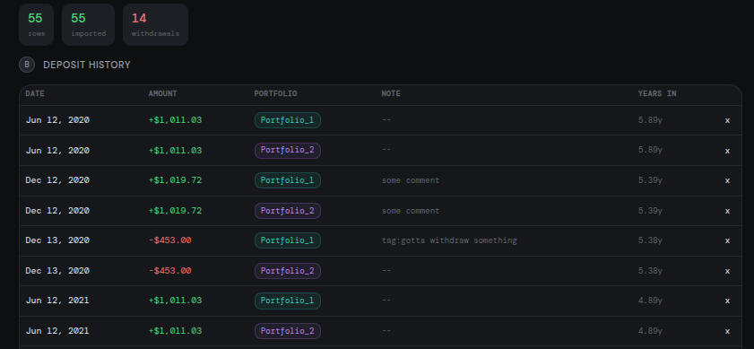
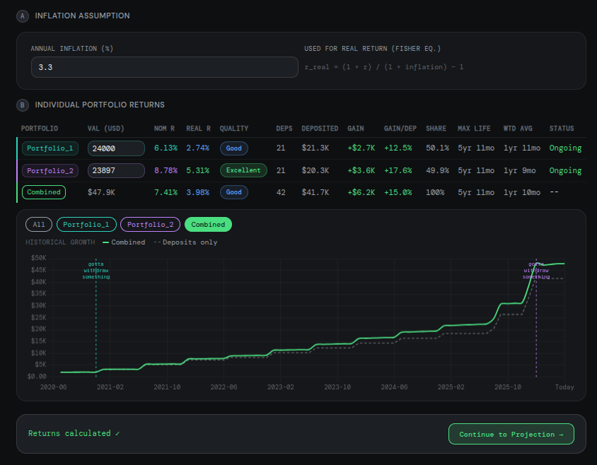
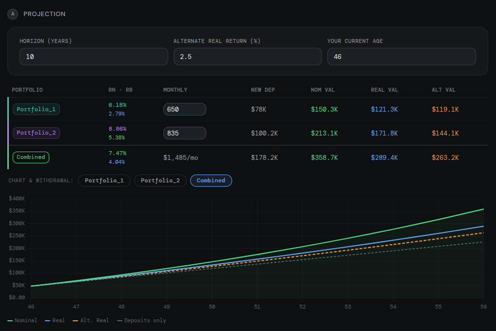
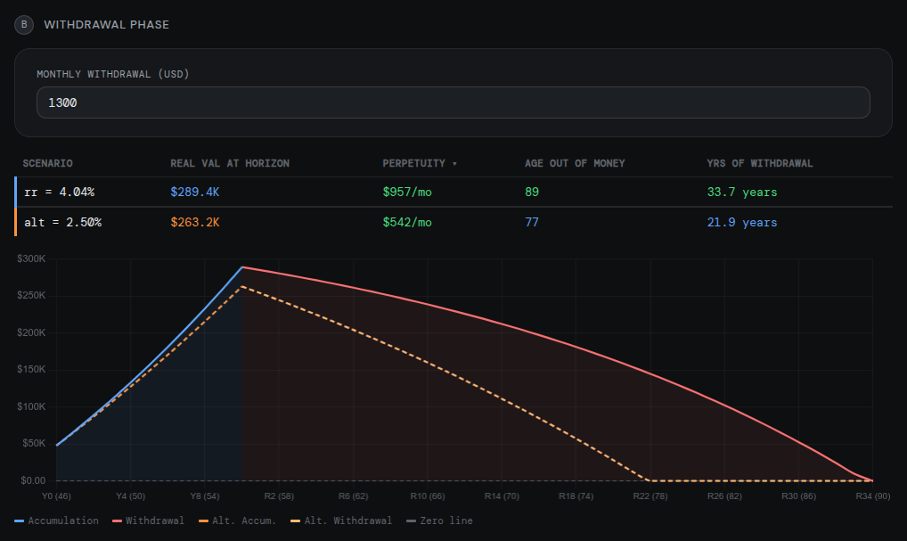

# Portfolio Tracker

A single-file, zero-dependency web app for tracking personal investment portfolios, computing money-weighted returns, and projecting retirement sustainability.

No server. No login. No data ever leaves your browser.

> **Disclaimer:** This tool is provided for informational and educational purposes only. It is not financial advice. Past returns do not guarantee future results. The projections produced by this tool are mathematical illustrations based on inputs you provide — they are not predictions. Do not make investment decisions based solely on this tool. The author bears no responsibility for financial outcomes resulting from use of this software.

BSD 3-Clause — see [LICENSE](LICENSE)

---

## Why this tool exists

An individual investor whose portfolio grows through irregular, real-world deposits needs an easy way to see the evolution of their investments.

This tool computes the **Money-Weighted Rate of Return (MWRR)**, which answers the question that actually matters:

> *Given exactly when and how much I invested, what annualized return does my portfolio imply?*

It then strips out inflation to give you a real return, and runs a simulation to tell you whether your projected retirement portfolio is sustainable at your target withdrawal rate.

> #### For a detailed guide on how to use and interpret the numbers, see [docs/GUIDE.md](docs/GUIDE.md)
> #### To understand the math supporting this tool, see [docs/MATH.md](docs/MATH.md)
> #### To see the changes along different versions of the tool, see [docs/CHANGELOG.md](docs/CHANGELOG.md)

---

## Workflow

The app is a 3-step wizard. Each step unlocks the next.

### Step 1 — Data

Upload an Excel file containing your deposit history. The mapper UI lets you match your file's column names to the required fields (date, amount, currency, portfolio name). ARS deposits are converted to USD using the exchange rate column if provided.

Deposits are stored in `sessionStorage` — they exist only for the duration of the browser tab and are wiped automatically when the tab is closed. Data never leaves your machine.

**The Excel file is source of truth #1.** You decide which cash flows are in scope. The tool does not validate financial reality — it only ensures the math is correct. What goes into the spreadsheet, and what stays out, is entirely your responsibility.

||
|:--:|
|Figure1: Loading of deposits and withdrawals|

### Step 2 — Returns

Each portfolio is a row in a table. Enter the current market value (VAL) directly in the table. Returns calculate automatically. Change the VAL or the inflation assumption and the rates update instantly.

**The broker-reported VAL is source of truth #2.** The tool has no connection to any broker or external service. Whatever market value your broker shows, you enter it here. The tool trusts it unconditionally.

**Inflation assumption:** enter the annual inflation rate (%) you consider representative of both your investment history and your planning horizon. This single rate serves two roles: it converts your historical $r_n$ into a real return ($r_r$) via the Fisher equation, and it is the same $r_r$ used to project future purchasing power in Step 3. The two interpretations are consistent as long as you accept this rate as representative of past and future inflation alike.

Since all deposits are converted to USD, the relevant benchmark is always **US CPI** regardless of your country of residence.

| Assumption | When to use |
|---|---|
| 2.5% | Market-implied US CPI (10-year TIPS breakeven); appropriate if you weight recent forward-looking expectations |
| 3% | Long-run US CPI average (post-WWII); standard base case |
| 4–4.5% | Conservative stress-test; reflects the high-inflation decades of 1965–1990 |
| > 4.5% | Extreme stress-test scenario |

A higher inflation assumption lowers the computed real return. When in doubt, run the tool twice (once at 3%, once at 4.5%) to bracket the outcome.

Each row shows: nominal r, real r, quality badge, deposit count, total deposited, gain, gain/dep, share of combined VAL, max lifetime, weighted average time, and status (Ongoing / Completed).

A combined row appears at the bottom once all portfolio VALs are entered and shows aggregated metrics across all portfolios.

Once at least one VAL is entered, a **historical growth chart** appears below the table. For each portfolio with a solved return, it plots the implied portfolio value from the first deposit date to today by compounding each deposit at $r_n$ from its deposit date — ending exactly at the entered VAL. A dashed reference line shows cumulative deposits over the same period. The combined line appears once all VALs are filled.

||
|:--:|
|Figure2: Nominal and Real rates|

### Step 3 — Projection & Withdrawal

Configure a time horizon, an optional alternate real return for scenario comparison, and your current age. The app projects each portfolio using its own nominal and real MWRR, plus a combined row.

A compact table shows each portfolio as a row with columns: nominal r · real r, monthly deposit (editable), new deposits over the horizon, Nominal VAL, Real VAL, and Alternate Real VAL (when an alternate rate is set). The combined row appears at the bottom.

The app projects:

- **Nominal VAL** — future value at the nominal MWRR
- **Real VAL** — future value in today's purchasing power
- **Alternate Real VAL** — same projection at a user-specified alternate real return, for scenario comparison

A growth chart overlays all three curves over the chosen horizon, with the x-axis labelled by actual age.

Below the chart, a sustainability simulation asks: *after the horizon ends, how much do you withdraw monthly?* It computes whether the portfolio survives indefinitely or depletes, and if so, at what age. Both the main scenario and the alternate scenario are shown together.

||
|:--:|
|Figure3: Porjection|

||
|:--:|
|Figure4: Withdrawal|

---

## Technical notes

- Single HTML file — no build system, no npm, no dependencies to install
- Bundled libraries: Chart.js 4.4.1 (MIT) and SheetJS 0.18.5 (Apache 2.0) — no CDN, no external requests
- State persisted in `sessionStorage` under keys `pt5_deps`, `pt5_vals`, `pt5_rs`, `pt5_monthly` — cleared automatically on tab close
- Fully bilingual: English and Spanish (Argentine locale)
- Supports `.xlsx` / `.xls` files
- Currency: USD native; ARS converted via per-row exchange rate

---

## Excel format

| Field | Required | Accepted column names |
|---|---|---|
| Deposit date | Yes | `date`, `fecha`, `fecha_deposito`, `transaction_date` |
| Deposit amount | Yes | `deposit_value`, `amount`, `monto`, `valor`, `importe` |
| Currency | Yes | `currency`, `moneda`, `currency_code` |
| Portfolio name | Yes | `portfolio`, `cartera`, `account`, `cuenta`, `fund` |
| USD exchange rate | No | `exchange_rate`, `tipo_cambio`, `fx`, `fx_rate`, `rate`, `tc` |
| Note | No | `nota`, `description`, `descripcion`, `comment` |

**Currency values accepted:**
- USD: `USD`, `US$`, `U$S`, `Dollar`, `Dolares`, `Dólar`
- ARS: `ARS`, `AR$`, `Pesos`, `Peso`

**Date formats accepted:**

| Format | Example | Notes |
|---|---|---|
| Excel date cell | *(native)* | Read directly as a Date object by SheetJS — most reliable, no ambiguity |
| `YYYY-MM-DD` | `2021-12-13` | ISO 8601; always unambiguous |
| ISO with time | `2021-12-13T00:00:00.000Z` | Time component stripped automatically |
| `DD/MM/YYYY` | `13/12/2021` | Argentine default; `/`, `-`, and `.` separators accepted |
| `MM/DD/YYYY` | `12/13/2021` | Detected automatically at the file level (see below) |

**MM/DD vs DD/MM detection:** the tool scans all dates in the file before importing any row. If any date has a second component greater than 12 (e.g. `10/31/2025` — month 31 is impossible), the entire file is treated as MM/DD/YYYY. This means ambiguous dates in the same file, such as `3/6/2024`, are correctly resolved to the same format (March 6, not June 3). If no unambiguous date is found, the file defaults to DD/MM/YYYY.

Using native Excel date cells (not text strings) is the most reliable option — SheetJS reads them directly as Date objects with no parsing ambiguity.

---

## Return quality labels

Each portfolio in Step 2 displays a badge based on its **real return**, not the nominal return. Nominal return is misleading as a quality signal because it includes inflation — a portfolio earning 8% nominal in a 10% inflation environment is actually losing purchasing power.

| Real r | Label | Color |
|---|---|---|
| > 5% | Excellent | Green |
| > 2% | Good | Blue |
| > 0% | Fair | Yellow |
| ≤ 0% | Poor | Red |

A portfolio with a high nominal r but negative real r will correctly show as **Poor**.
